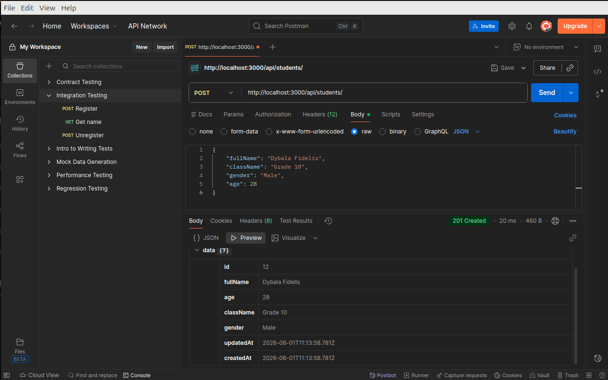
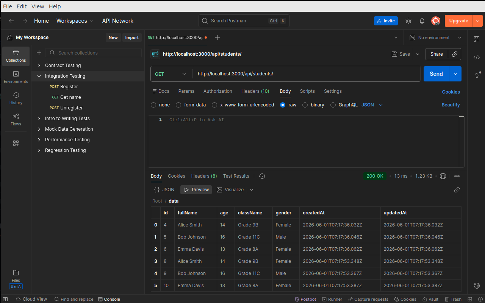
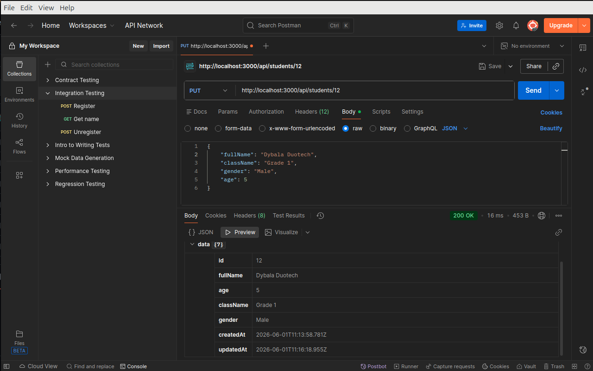
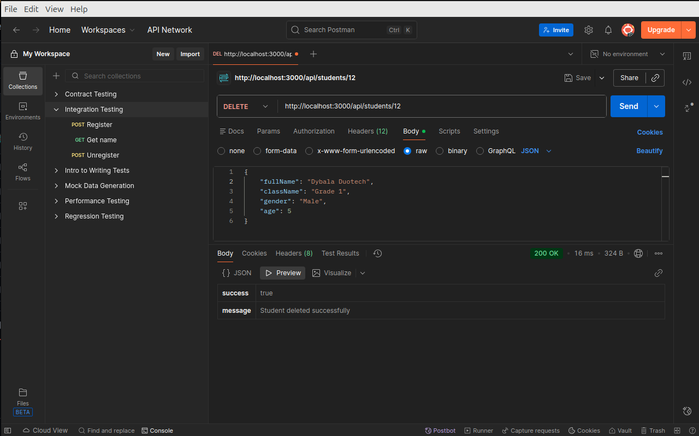

# API Reference

[← Back to README](../README.md)

Base URL: `http://localhost:3000`

All student requests use `Content-Type: application/json`.

## Endpoints Summary

| Method | Endpoint | Description |
|--------|----------|-------------|
| GET | `/` | Health check |
| POST | `/api/students` | Add a new student |
| GET | `/api/students` | View all students |
| GET | `/api/students/:id` | View one student |
| PUT | `/api/students/:id` | Update a student |
| PATCH | `/api/students/:id` | Partially update a student |
| DELETE | `/api/students/:id` | Delete a student |

## Student Object

```json
{
  "id": 1,
  "fullName": "Jane Doe",
  "age": 15,
  "className": "Grade 10",
  "gender": "Female",
  "createdAt": "2026-05-31T12:00:00.000Z",
  "updatedAt": "2026-05-31T12:00:00.000Z"
}
```

| Field | Type | Required | Description |
|-------|------|----------|-------------|
| fullName | string | Yes (create) | Full name |
| age | integer | Yes (create) | Age (1–100) |
| className | string | Yes (create) | Class / grade |
| gender | string | Yes (create) | Gender |

---

## Health Check

```
GET /
```

**Response (200):**

```json
{ "message": "School Management System API is running!" }
```

---

## Add a Student

```
POST /api/students
```

**Body:**

```json
{
  "fullName": "Jane Doe",
  "age": 15,
  "className": "Grade 10",
  "gender": "Female"
}
```

**Response (201):**

```json
{
  "success": true,
  "data": {
    "id": 1,
    "fullName": "Jane Doe",
    "age": 15,
    "className": "Grade 10",
    "gender": "Female",
    "createdAt": "...",
    "updatedAt": "..."
  }
}
```

**Postman screenshot:**



---

## View All Students

```
GET /api/students
```

**Response (200):**

```json
{
  "success": true,
  "data": [
    {
      "id": 1,
      "fullName": "Jane Doe",
      "age": 15,
      "className": "Grade 10",
      "gender": "Female",
      "createdAt": "...",
      "updatedAt": "..."
    }
  ]
}
```

**Postman screenshot:**



---

## View Student by ID

```
GET /api/students/:id
```

**Response (200):**

```json
{ "success": true, "data": { ... } }
```

**Response (404):**

```json
{ "success": false, "message": "Student not found" }
```

---

## Update a Student

```
PUT /api/students/:id
```

All fields optional; only sent fields are updated.

```json
{
  "fullName": "Jane Smith",
  "age": 16,
  "className": "Grade 11",
  "gender": "Female"
}
```

**Response (200):**

```json
{ "success": true, "data": { ... } }
```

**Postman screenshot:**



---

## Partially Update a Student

```
PATCH /api/students/:id
```

Send only fields to change. At least one field required.

```json
{ "age": 16 }
```

**Response (200):**

```json
{ "success": true, "data": { ... } }
```

---

## Delete a Student

```
DELETE /api/students/:id
```

**Response (200):**

```json
{
  "success": true,
  "message": "Student deleted successfully"
}
```

**Postman screenshot:**



---

## Error Responses

```json
{
  "success": false,
  "message": "Error description"
}
```

| Status | Example |
|--------|---------|
| 400 | Missing or invalid fields |
| 404 | Student not found |
| 500 | Internal server error |

---

## Related

- [Postman Guide](postman.md)
- [Setup Guide](setup.md)
